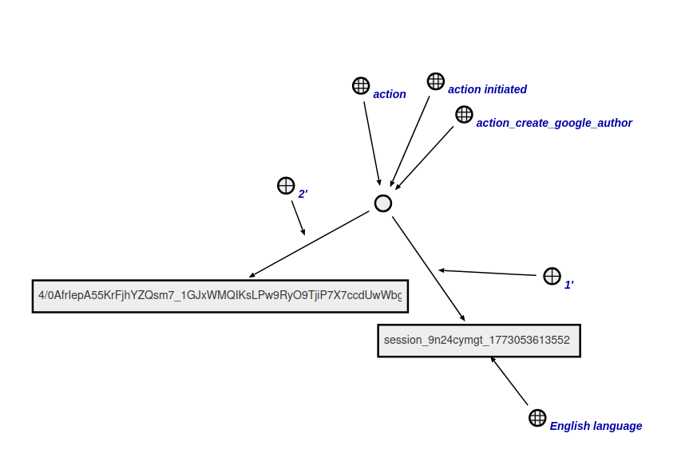
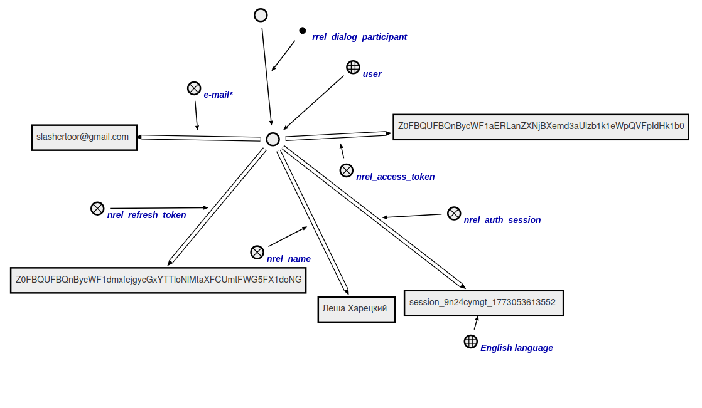

# Агент создания автора

Данный агент генерирует в базе знаний узел автора с его учетным данными.

**Класс действий:**

`action_create_google_author`

**Параметры:**

1. Сессия из браузера;
2. Код, полученный из OAuth2.0 сервиса.

**Ход работы агента:**

* Агент при помощи кода отправляет запрос на OAuth2.0 сервис для получения метаданных о пользователе(имя и адрес почты).
* Агент генерирует узел автора(элемент класса `concept_user`).
* Вызывается [агент генерации токенов доступа](./createTokensAgent.ru.md).
* После получения метаданных они привязываются к узлу автора вместе с сессией браузера в sc-памяти.
* Агент генерирует узел диалога(элемент класса `concept_dialogue`) и привязывает автора к нему.
* Агент завершает работу.

## Пример

Пример входной структуры:

Структура-результат работы агента:

## Результат

Возможные результаты:

* `SC_RESULT_OK` - автор сгенерирован;
* `SC_RESULT_ERROR`- внутренняя ошибка.
