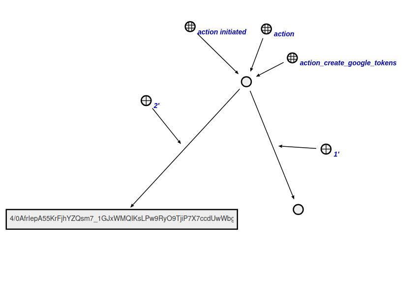
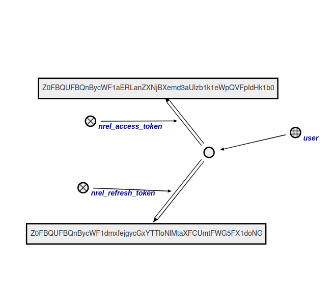

# Create Access Tokens Agent

This agent generates access tokens in the knowledge base and links them to the author node.

**Action class:**

`action_create_google_tokens`

**Parameters:**

1. Author node;
2. Code obtained from OAuth2.0 service.

**Agent workflow:**

* The agent uses the code to send a request to the OAuth2.0 service to obtain access tokens.

* After receiving the tokens, they are encrypted and linked to the author node.

* The agent completes its work.

## Example

Example of input structure:

Resulting structure of the agent's work:

## Result

Possible results:

* SC_RESULT_OK - tokens generated;
* SC_RESULT_ERROR - internal error.
