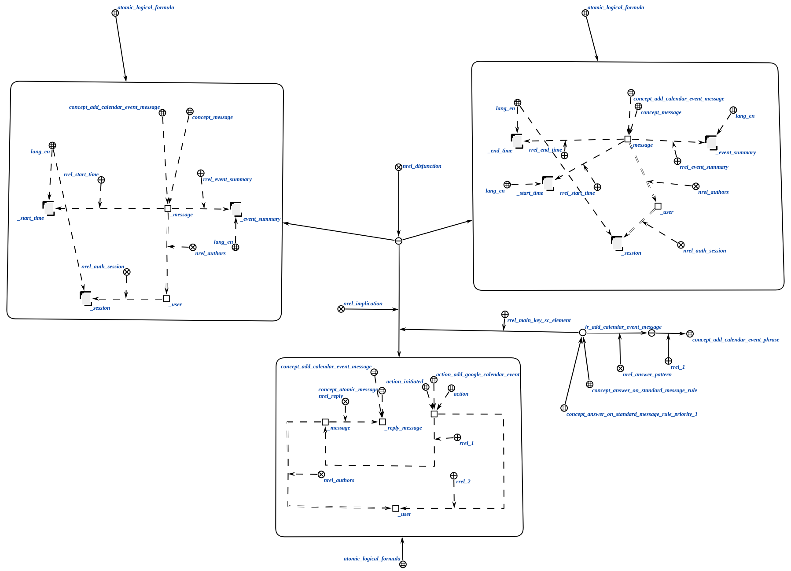
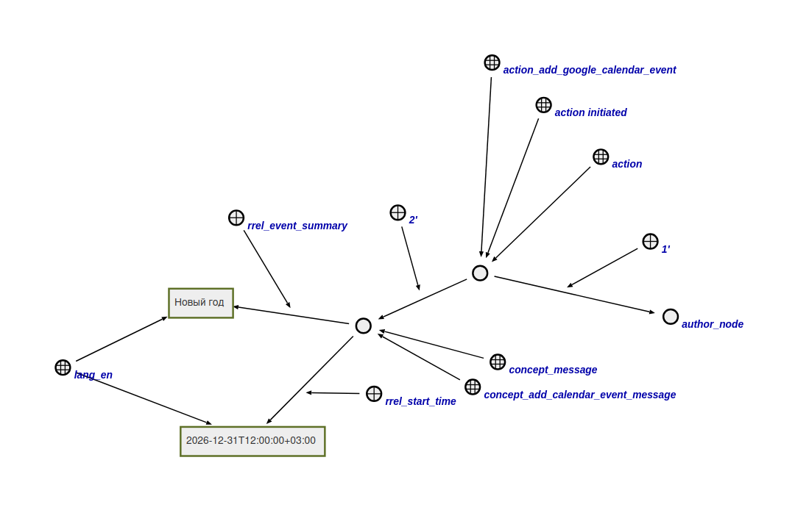

# Google Calendar Event Addition Agent

This agent creates an event in the calendar based on characteristics obtained from the classifier.

**Action class:**

`action_add_google_calendar_event`

**Parameters:**

1. Message node;
2. Authorized user node.

The logical rule that activates the agent is shown below.

Required event parameters in the message:

- title;
- start time (in UTC format).

Optionally, you can specify the end time (in UTC format). If the end time is not specified, it will be set to one hour after the start time.

**Agent workflow:**

- The agent searches for all event parameters.
- The agent finds the access token of the message author.
- The agent sends a request to the Google Calendar API to create an event with the found parameters using the access token.
- The agent completes its work.

## Example

Example input structure:

If the agent executes successfully, an event with the specified characteristics will appear in the author's calendar.

## Result

Possible results:

- `SC_RESULT_OK` - event created successfully;
- `SC_RESULT_ERROR` - internal error.
