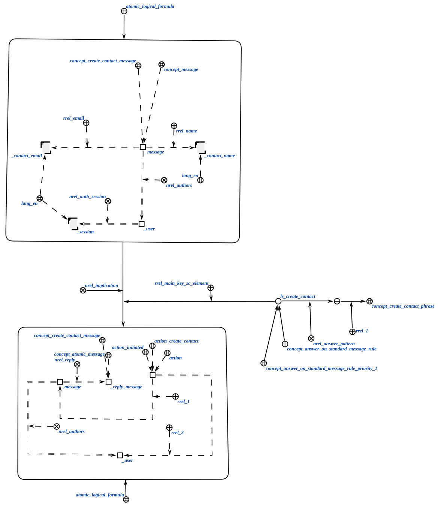
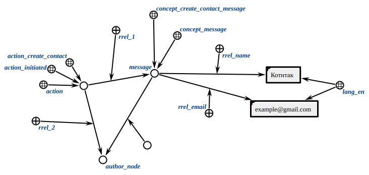

# Contact Creation Agent

This agent generates a contact node in the knowledge base associated with the message author. The contact has a name and an email address.

**Action class:**

`action_create_contact`

**Parameters:**

1. Message node;
2. Authorized user node.

The logical rule that activates the agent is shown below.

**Agent workflow:**

* The agent finds all contact parameters in the message.
* The agent links the generated contact node to the author node.
* The agent completes its work.

## Example

Example input structure:

As a result, a contact node will be linked to the author.

## Result

Possible results:

* `SC_RESULT_OK` - contact generated successfully;
* `SC_RESULT_ERROR` - internal error.