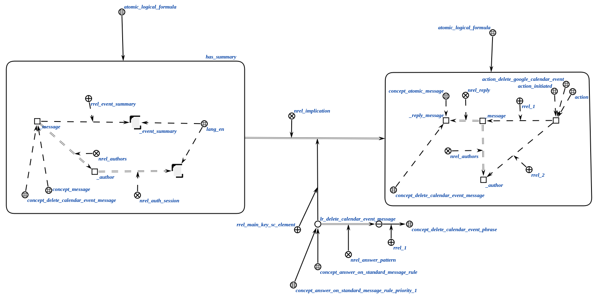
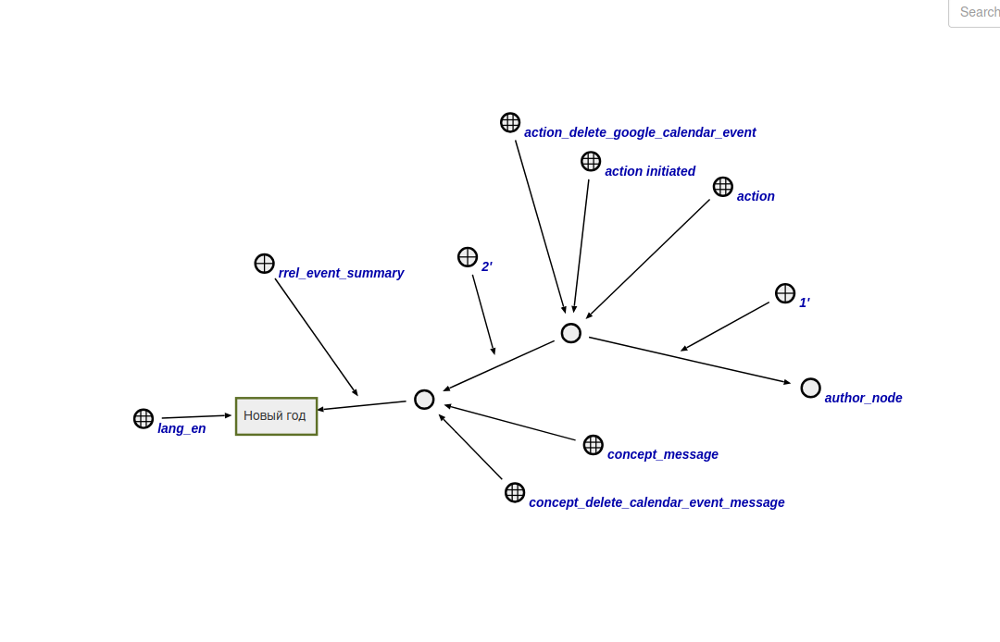

# Агент удаления события из гугл календаря

Данный агент удаляет событие из календаря на основе характеристик, полученных от классификатора.

**Класс действий:**

`action_delete_google_calendar_event`

**Параметры:**

1. Узел сообщения;
2. Узел авторизованного пользователя.

Логическое правило, активирующее агента изображено ниже.

Обязательные параметры события в сообщении:

- название.

**Ход работы агента:**

- Агент ищет все параметры события.
- Агент находит токен доступа автора сообщения.
- Агент отправляет запрос в Google Calendar API на удаление события с найденными параметрами при помощи токена доступа.
- Агент завершает работу.

## Пример

Пример входной структуры:

Если агент отработает успешно, тогда в календаре автора удалится первое найденное событие с заявленными характеристиками.

## Результат

Возможные результаты:

- `SC_RESULT_OK` - событие удалено;
- `SC_RESULT_ERROR`- внутренняя ошибка.
