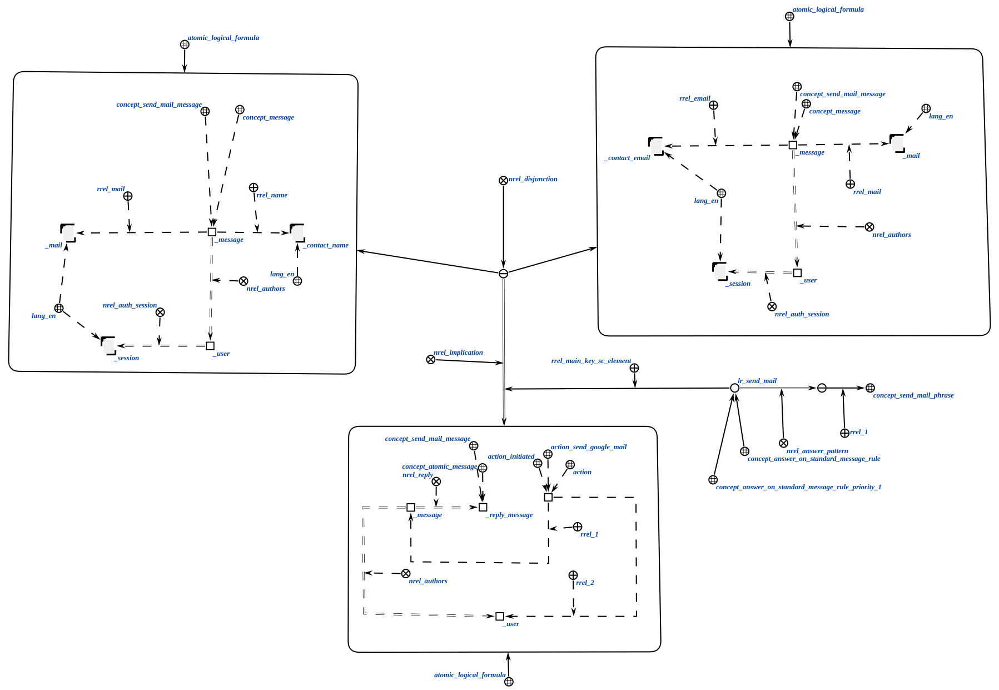
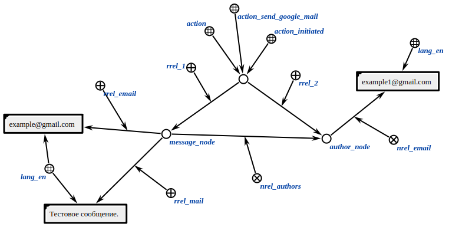

# Агент отправки сообщения по почте

Данный агент при помощи протокола SMTP отправляет сообщение по почте.

**Класс действий:**

`action_send_google_mail`

**Параметры:**

1. Узел сообщения;
2. Узел авторизованного пользователя.

Логическое правило, активирующее агента изображено ниже.

В параметрах сообщения необходимо указать текст отправляемого по почте сообщения и либо адрес почты, либо имя контакта, куда его надо отправить.

**Ход работы агента:**

- Агент ищет все параметры сообщения.
- Агент находит адрес почты автора сообщения.
- Агент отправляет сообщения по протоколу SMTP;
- Агент завершает работу.

## Пример

Пример входной структуры:

Если агент отработает успешно, тогда от имен автора отправиться сообщения по указанному адресу.

## Результат

Возможные результаты:

- `SC_RESULT_OK` - сообщение отправлено;
- `SC_RESULT_ERROR`- внутренняя ошибка.
